import './script.js'
import { Head, Appear, Notes, Image} from 'mdx-deck'
import AppearNone from './components/AppearNone';
import AppearDisappear from './components/AppearDisappear';
import Troll from './components/Troll';
import {Features} from './components/Features'
import theme from './theme';

<Head>
  <title>Alexa + AWS</title>
</Head>

  Alexa, tu nueva Project Manager

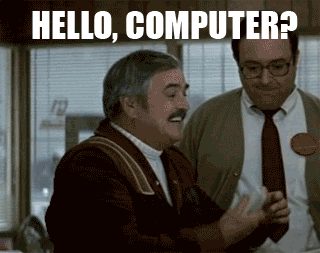
---

<Troll max={6}/>

  <ul>
      <AppearNone>
        <li>Como hacer que Alexa te haga un </li>
        <li></li>
        <li>Codigo y mas codigo </li>
        <li></li>
        <li>Como hacer que alexa trabaje por ti </li>
        <li></li>
        
      </AppearNone>
  </ul>

---

 <Image src="public/emosido.jpg"/>

---

## Ahora en serio, vamos a hablar sobre:
<ul style={{fontSize: 40, textAlign: 'left'}}>
  <Appear>
    <li>¿Qué es Alexa?</li>
    <li>Que puede hacer por nosotros</li>
    <li>Como crear tu propia skill</li>
  </Appear>
</ul>

---

## ¿Qué es Alexa?
<Appear>
    
</Appear>
---

## ¿Qué es Alexa?
<ul style={{width: '700px', height: '600px', fontSize: 40, textAlign: 'left', paddingTop: '200px', position: 'relative'}}>
    <Appear>
        <li>Amazon Echo</li>
        
        <li style={{'paddingTop': '50px'}}>Cerebro en la nube</li>
        
        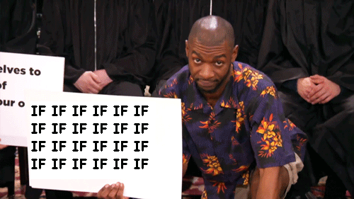
    </Appear>
</ul>
---
## ¿Cómo funciona?

   

---

## Que puede hacer por nosotros
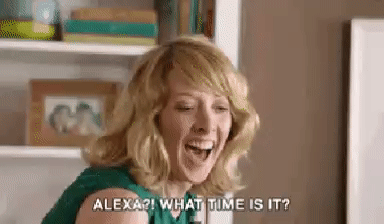
<Features/>

---

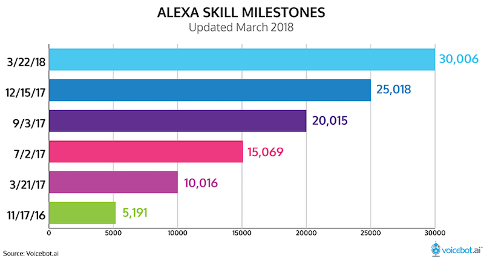

---

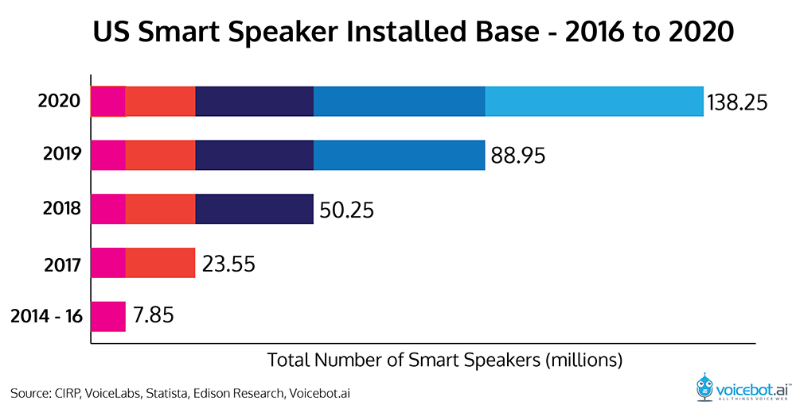

---

## Como crear tu propia skill
### (Skill development)
<AppearDisappear>
  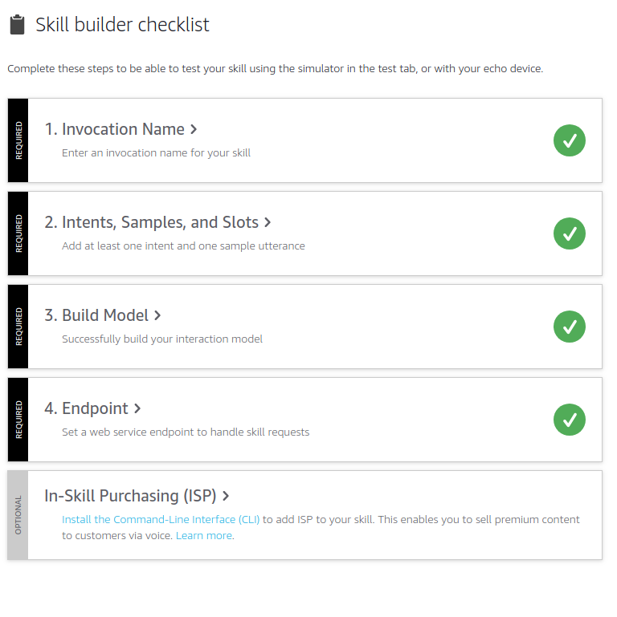
  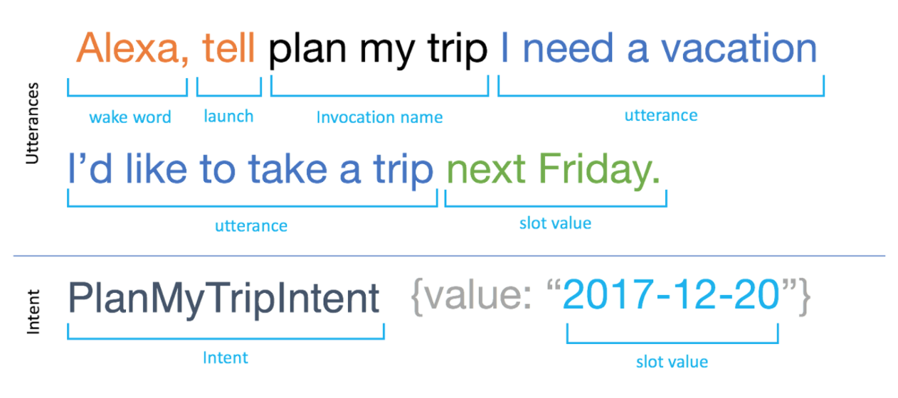
</AppearDisappear>

---
## Como crear tu propia skill
### (Skill logic)

<AppearDisappear>
  
  

   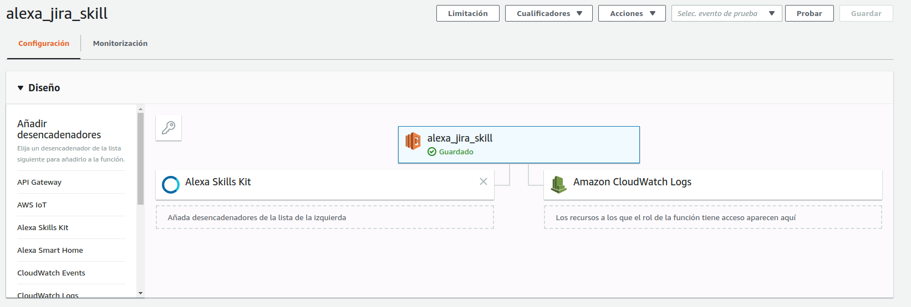
   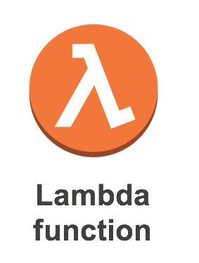
   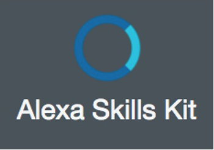
  

  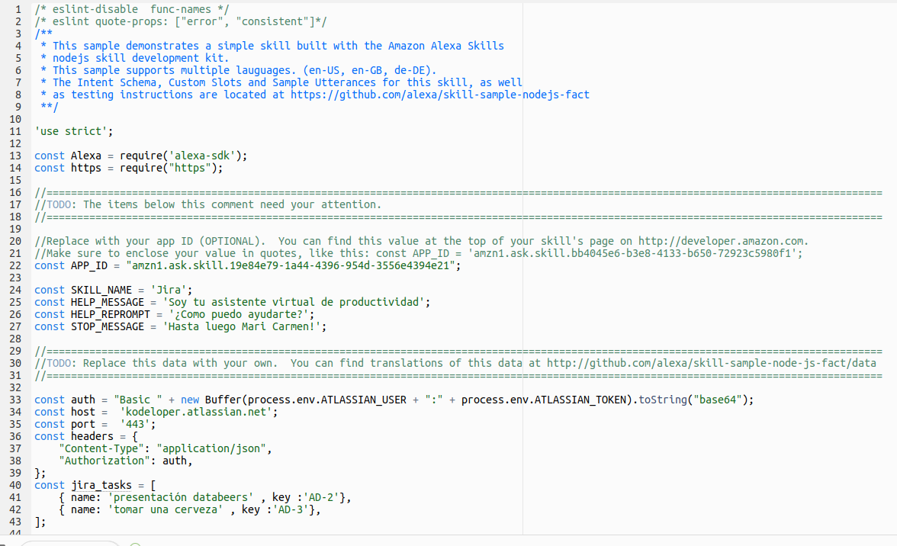
</AppearDisappear>

---
## La hora de la verdad
<AppearDisappear>
  
  
</AppearDisappear>
---
# ¿Aún queda cerveza?

---
 <h2>Gracias</h2>